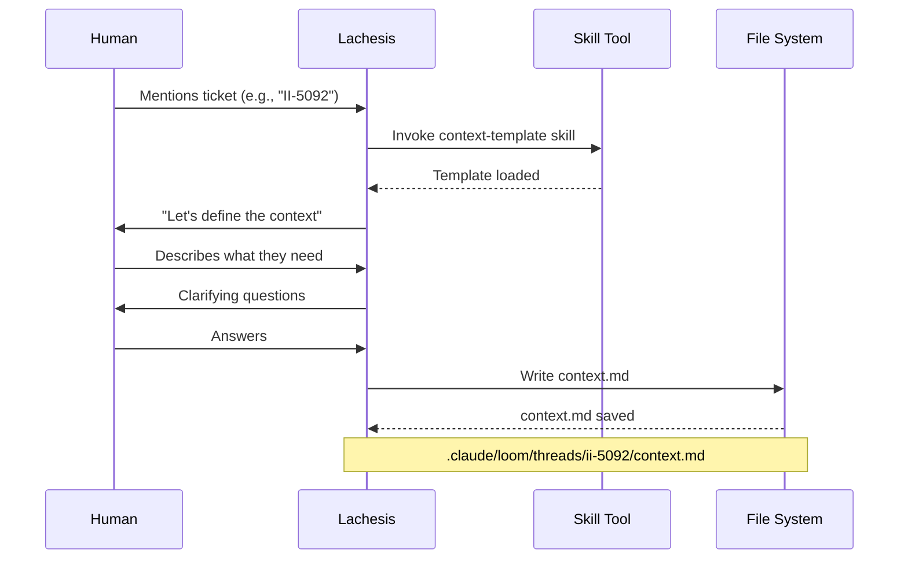
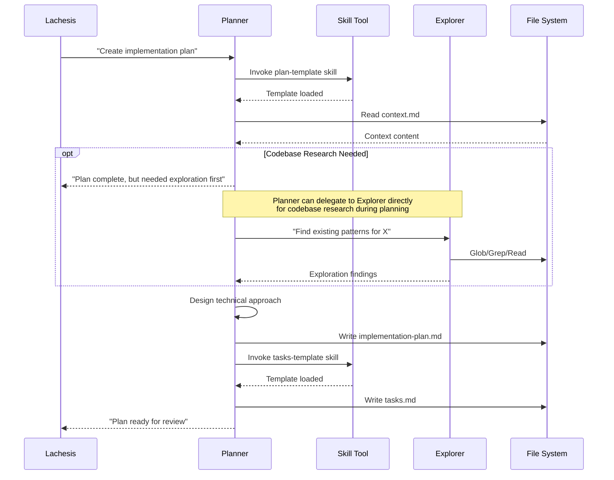
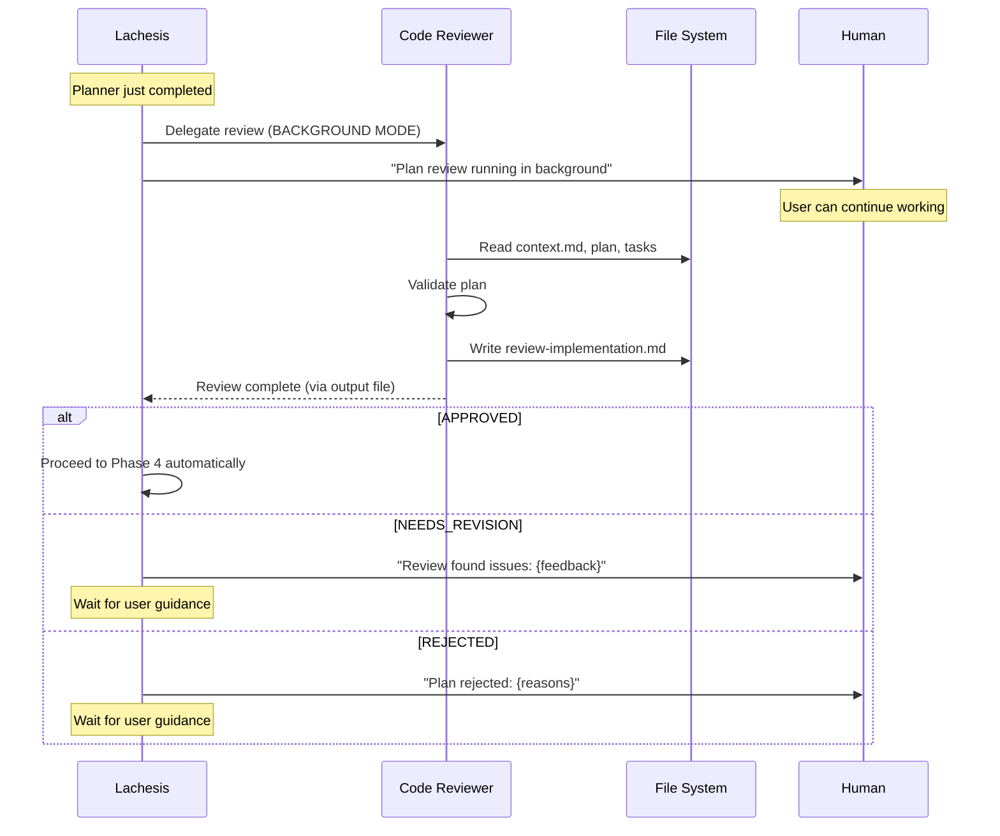
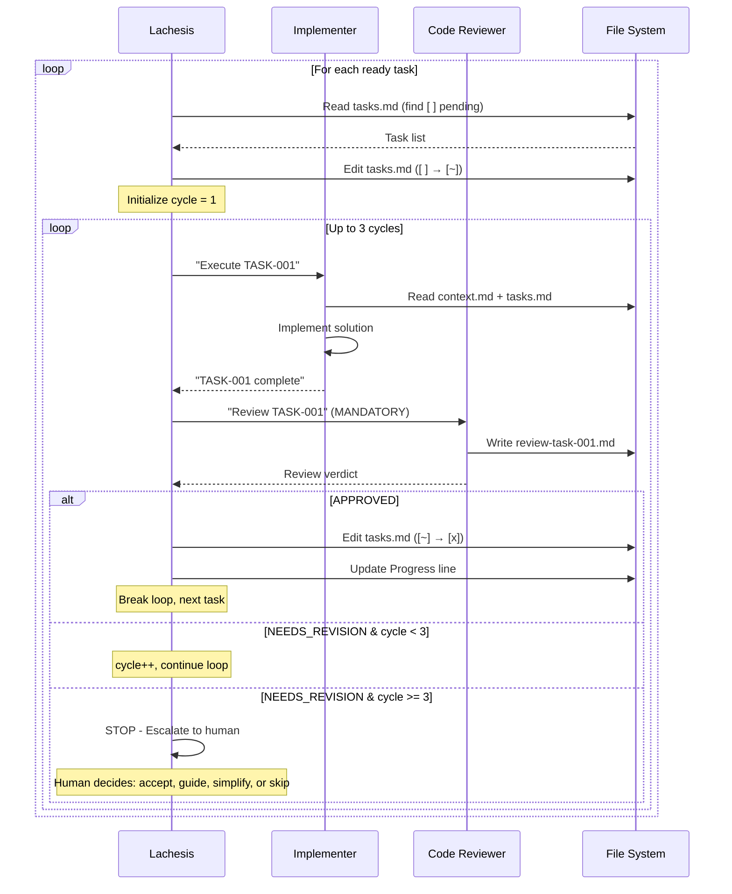
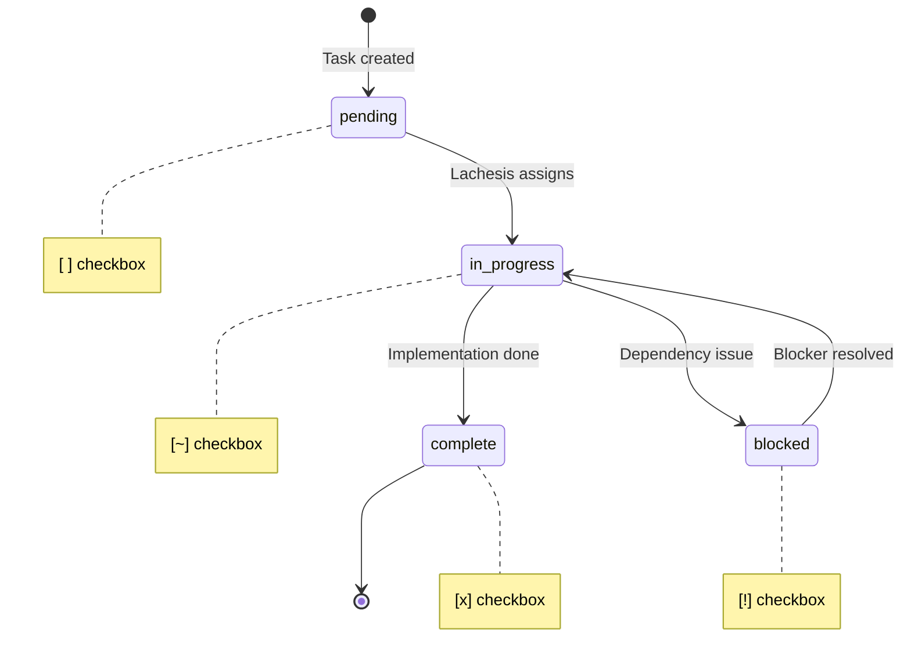
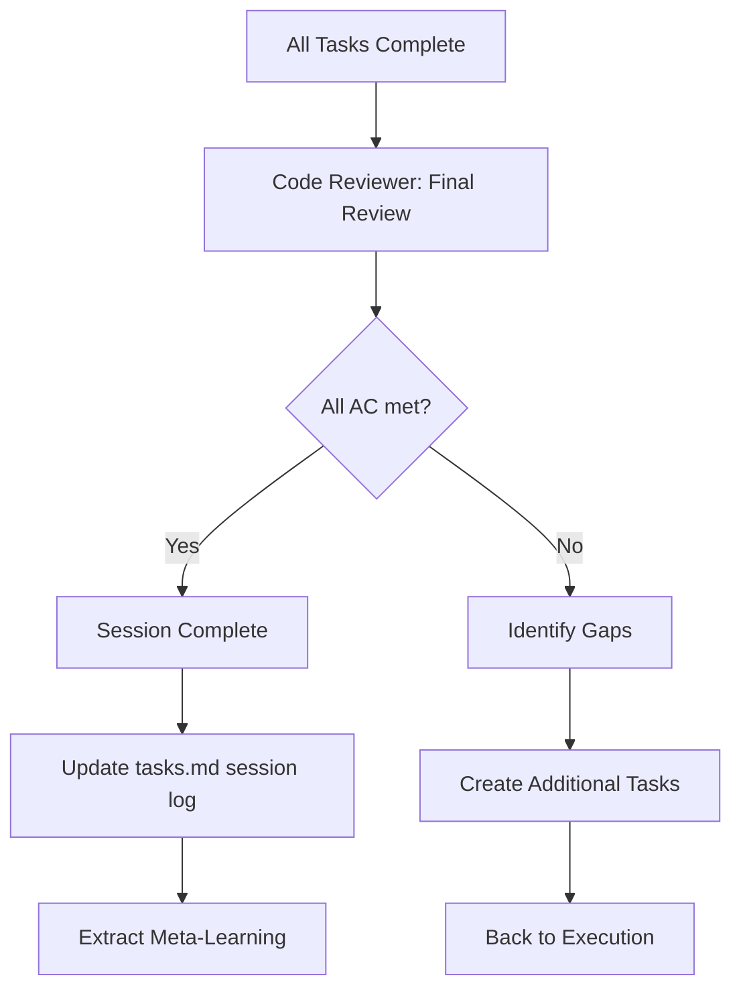
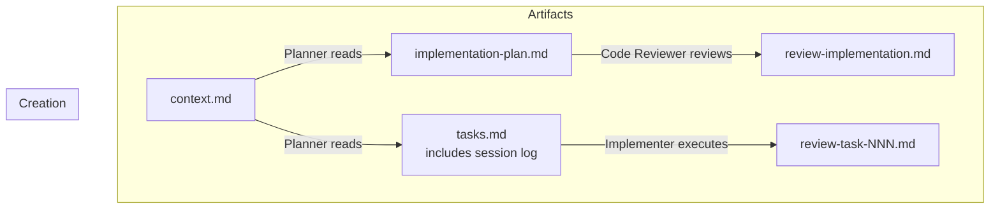
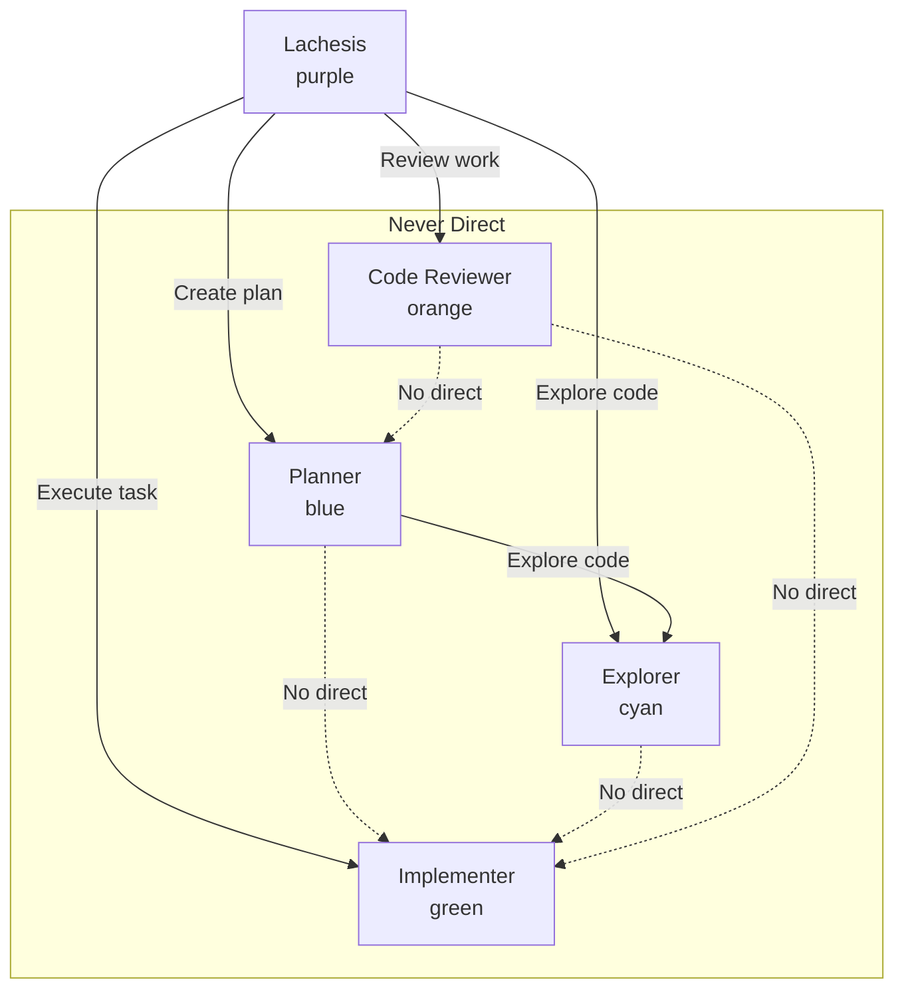

# Loom Plugin Workflow

This document explains how the Loom plugin coordinates multi-agent development workflows.

## Overview

Loom follows a **Context → Plan → Review → Execute** flow, with **Lachesis** (the coordinator agent) directing specialist agents through each phase.


## Mode Selection

At session start, Lachesis presents two workflow modes:

### Research Mode
For exploring ideas and designing before coding:
1. **Reconnaissance** - Explorer gathers codebase context
2. **Understanding** - Sequential questions about purpose, constraints, success
3. **Exploration** - 2-3 approaches with trade-offs
4. **Design Validation** - Incremental section-by-section validation
5. **Documentation** - Write context.md and research.md
6. **Handoff** - Transition to Ticket mode for implementation

### Ticket Mode
For executing on defined work:
1. **Context Definition** - What, Why, Acceptance Criteria
2. **Planning** - Implementation plan and task breakdown
3. **Review** - Plan approval
4. **Execution** - Task implementation with review cycles
5. **Completion** - Final review and summary

### Artifact Flow Between Modes

```
Research Mode          Ticket Mode
─────────────          ───────────
context.md ──────────► context.md
research.md ─────────► (informs implementation-plan.md)
                       implementation-plan.md
                       tasks.md
                       review-*.md
```

## The Agents

| Agent | Model | Role | Color |
|-------|-------|------|-------|
| **Lachesis** | Opus | Coordinates workflow, never implements | Purple |
| **Planner** | Sonnet | Creates plans and task breakdowns | Blue |
| **Code Reviewer** | Sonnet | Reviews plans and implementations | Orange |
| **Implementer** | Sonnet | Executes individual tasks | Green |
| **Explorer** | Haiku | Fast codebase reconnaissance | Cyan |

## Skills-First Architecture

Loom uses **skills instead of MCP tools**. Before writing any artifact, agents must invoke the corresponding template skill:

| Artifact | Required Skill |
|----------|---------------|
| `context.md` | `context-template` |
| `implementation-plan.md` | `plan-template` |
| `tasks.md` | `tasks-template` |
| `review-*.md` | `review-template` |
| `research.md` | `research-template` |

## Automatic Progression & Background Reviews

The Loom workflow uses **automatic progression** on the happy path to minimize user interruptions:

| After... | Lachesis does... | Mode |
|----------|------------------|------|
| Planner completes | Immediately delegates to code-reviewer | **Background** |
| Review: APPROVED | Immediately proceeds to next phase | Automatic |
| Implementer completes | Immediately delegates to code-reviewer | Foreground |
| Task review: APPROVED | Marks complete, proceeds to next task | Automatic |

### Background Review Behavior

When the planner completes creating `implementation-plan.md` and `tasks.md`:

1. **No confirmation needed** - Lachesis immediately delegates to code-reviewer
2. **Background mode** - Uses `run_in_background: true` so user can continue working
3. **User notified** - "Plan review running in background. You can continue working."
4. **Output file** - When complete, Lachesis reads the output file to get the verdict

### Automatic Proceed on APPROVED

When code-reviewer returns **APPROVED**:
- Automatically proceed to next phase without asking user
- For plan approval: proceed to execution phase
- For task approval: mark task complete, proceed to next task

### User Intervention Points

Lachesis **stops and waits for user guidance** when:
- **NEEDS_REVISION** verdict - User decides how to address feedback
- **REJECTED** verdict - Fundamental issues need resolution
- **3-cycle limit reached** - Human escalation required

This means the happy path (context → plan → review:APPROVED → execution) flows automatically with reviews running in the background.

## Detailed Workflow

### Phase 1: Context Definition

The human and Lachesis collaborate to define **What**, **Why**, and **Acceptance Criteria**.



**context.md contains:**
- **What**: The deliverable
- **Why**: Business value
- **Acceptance Criteria**: Measurable success conditions
- **Constraints**: Technical/business requirements
- **Out of Scope**: What NOT to build

### Phase 2: Planning

The **Planner** transforms context into actionable work.



**Planner outputs:**

1. **implementation-plan.md**
   - Technical approach
   - Architecture decisions
   - AC → Task mapping
   - Risks & mitigations

2. **tasks.md**
   - Atomic tasks (1-15 min each)
   - Agent assignments
   - Dependencies
   - Per-task acceptance criteria

### Phase 3: Review Loop (Automatic & Background)

The **Code Reviewer** validates the plan against context.md. This phase runs **automatically in background**.



```mermaid
flowchart TD
    PLAN[implementation-plan.md] --> CR[Code Reviewer Reviews]
    CR --> VERDICT{Verdict?}

    VERDICT -->|APPROVED| EXEC[Proceed to Execution<br/>AUTOMATICALLY]
    VERDICT -->|NEEDS_REVISION| STOP1[STOP - Inform User]
    VERDICT -->|REJECTED| STOP2[STOP - Escalate to Human]

    STOP1 --> PLANNER[User decides → Back to Planner]
    STOP2 --> HUMAN[User resolves fundamental issues]

    PLANNER --> |Revises plan| PLAN

    subgraph Review Checks
        CHK1[Every AC has tasks?]
        CHK2[Constraints respected?]
        CHK3[Out of scope excluded?]
        CHK4[Tasks atomic & correct?]
        CHK5[Dependencies valid?]
    end

    CR --> Review Checks
```

**Review verdicts:**
- **APPROVED**: Plan meets all criteria, **automatically proceed**
- **NEEDS_REVISION**: Issues found, **stop and inform user**
- **REJECTED**: Fundamental problems, **stop and escalate to user**

### Phase 4: Task Execution (Mandatory Review Cycle)

**Lachesis** coordinates task execution through the **Implementer** with **mandatory Code Reviewer review** after each task. A maximum of 3 cycles prevents endless gold-plating loops.



### Task Lifecycle



### Phase 5: Completion

Final review validates all acceptance criteria are met.



## Artifact Flow

All artifacts are stored in `.claude/loom/threads/{ticket-id}/`:



## Agent Interaction Map



**Key rules:**
- Lachesis coordinates all major workflow transitions
- Planner MAY delegate directly to Explorer (for codebase research during planning)
- Code Reviewer reports verdicts to Lachesis who handles routing
- Only Lachesis delegates to Planner, Code Reviewer, Implementer
- Explorer is read-only and never delegates

## Complete Session Flow

```mermaid
flowchart TD
    START([Human mentions ticket]) --> INIT[Initialize Session]
    INIT --> SKILL1[Invoke context-template skill]
    SKILL1 --> CONTEXT[Define Context]
    CONTEXT --> EXPLORE{Need exploration?}

    EXPLORE -->|Yes| EXPLORER[Explorer: Reconnaissance]
    EXPLORER --> PLANNING
    EXPLORE -->|No| PLANNING[Planner: Create Plan]

    PLANNING --> SKILL2[Invoke plan-template + tasks-template skills]
    SKILL2 --> REVIEW[Code Reviewer: Review Plan<br/>BACKGROUND MODE]
    REVIEW --> SKILL3[Invoke review-template skill]
    SKILL3 --> VERDICT{Approved?}

    VERDICT -->|No: NEEDS_REVISION| STOP_REV[STOP - Inform User]
    STOP_REV --> REVISE[User decides → Planner: Revise]
    REVISE --> REVIEW

    VERDICT -->|Yes| EXECUTE[Execute Tasks<br/>AUTO-PROCEED]

    EXECUTE --> TASK_LOOP{More tasks?}
    TASK_LOOP -->|Yes| NEXT_TASK[Get Ready Task]
    NEXT_TASK --> UPDATE_START[Edit tasks.md: [ ] → ~]
    UPDATE_START --> INIT_CYCLE[Initialize cycle = 1]
    INIT_CYCLE --> IMPLEMENT[Implementer: Execute]
    IMPLEMENT --> CR_REVIEW[Code Reviewer: Review Task - MANDATORY]

    CR_REVIEW --> TASK_OK{Approved?}
    TASK_OK -->|No, cycle < 3| IMPL_AGAIN[Increment cycle]
    IMPL_AGAIN --> IMPLEMENT
    TASK_OK -->|No, cycle >= 3| HUMAN_INT[Human Intervention]
    HUMAN_INT --> UPDATE_DONE
    TASK_OK -->|Yes| UPDATE_DONE[Edit tasks.md: ~ → x]

    UPDATE_DONE --> TASK_LOOP

    TASK_LOOP -->|No| FINAL[Code Reviewer: Final Review]
    FINAL --> DONE{All AC met?}

    DONE -->|No| GAP_TASKS[Create Gap Tasks]
    GAP_TASKS --> EXECUTE

    DONE -->|Yes| COMPLETE([Session Complete])

    style START fill:#e1bee7
    style COMPLETE fill:#c8e6c9
    style EXPLORER fill:#b2ebf2
    style PLANNING fill:#bbdefb
    style REVIEW fill:#ffe0b2
    style IMPLEMENT fill:#c8e6c9
```

## Example Session

```
Human: "Let's work on II-5092 - Add user preferences API"

Lachesis:
  [Invokes context-template skill]
  Helps define context
  → Writes: context.md

Lachesis → Planner: "Create the implementation plan"
  [Planner invokes plan-template skill]
  [Planner invokes tasks-template skill]
  → Writes: implementation-plan.md, tasks.md

Lachesis → Code Reviewer (BACKGROUND): "Review the plan"
  [Tells user: "Plan review running in background"]
  [Code Reviewer invokes review-template skill]
  → Writes: review-implementation.md (APPROVED)

Lachesis: [Reads output file, sees APPROVED]
  [AUTO-PROCEEDS to execution]
  [Edits tasks.md: TASK-001 [ ] → [~]]
  [Initialize cycle = 1]

Lachesis → Implementer: "Execute TASK-001"
  → Changes: src/api/preferences.ts

Lachesis → Code Reviewer: "Review TASK-001" (MANDATORY)
  → Writes: review-task-001.md (APPROVED after 1 cycle)

Lachesis:
  [Edits tasks.md: TASK-001 [~] → [x], Progress: 1/5]
  [Session Log: TASK-001 completed, 1 cycle]

... repeat for remaining tasks ...

Lachesis → Code Reviewer: "Final review against context.md"
  → All acceptance criteria met

Lachesis: "II-5092 complete!"
```

## Skill Reference

| Skill | Used By | Purpose |
|-------|---------|---------|
| `loom-workflow` | Lachesis, Planner, Code Reviewer | Master workflow and delegation patterns |
| `context-template` | Lachesis | Template for context.md |
| `plan-template` | Planner | Template for implementation-plan.md |
| `tasks-template` | Planner | Template for tasks.md |
| `review-template` | Code Reviewer | Template for review files |
| `research-template` | Lachesis | Template for research.md |

## Tool Reference

All agents use native Claude Code tools:

| Tool | Used By | Purpose |
|------|---------|---------|
| `Read` | All | Read files |
| `Write` | Lachesis, Planner, Code Reviewer, Implementer | Create files |
| `Edit` | Lachesis, Implementer | Update existing files |
| `Glob` | All | Find files |
| `Grep` | All | Search file contents |
| `Bash` | Implementer | Run commands |
| `Task` | Lachesis, Planner* | Delegate to agents |
| `Skill` | Lachesis, Planner, Code Reviewer | Load template skills |

*Planner may only delegate to Explorer for codebase research
