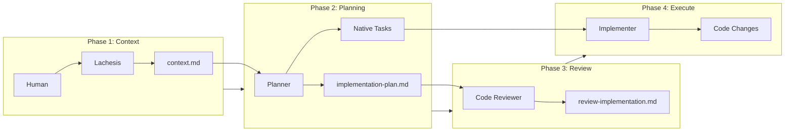
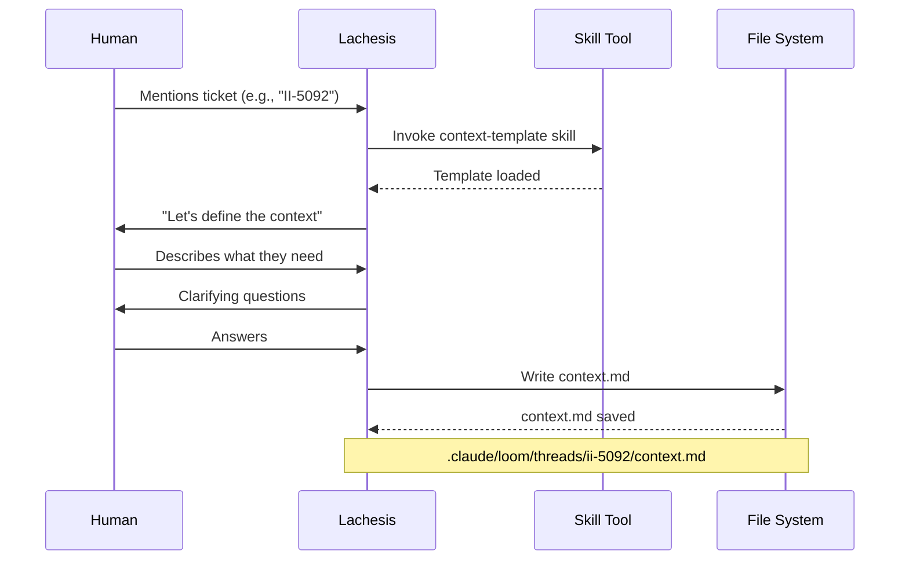
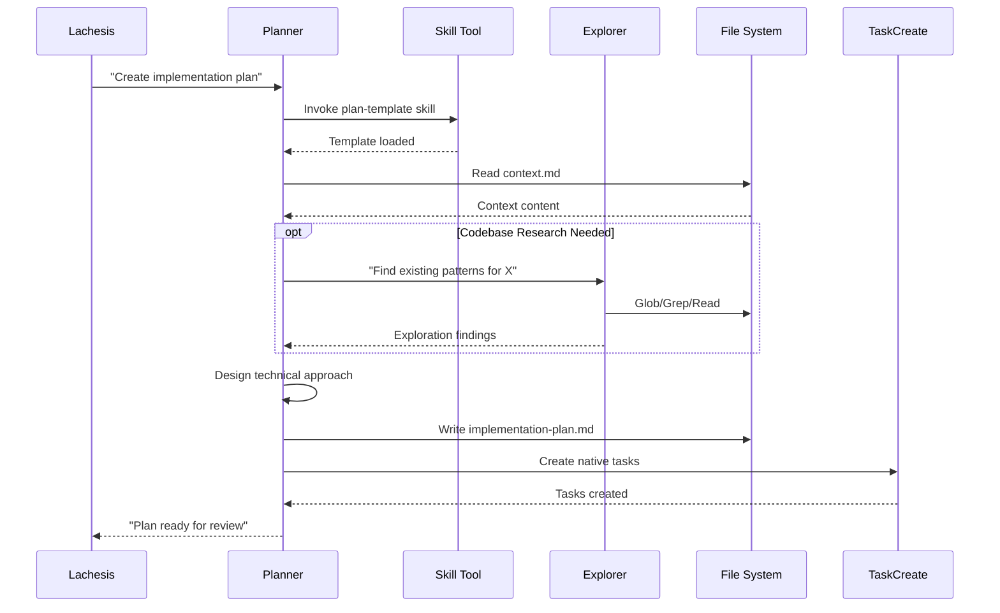
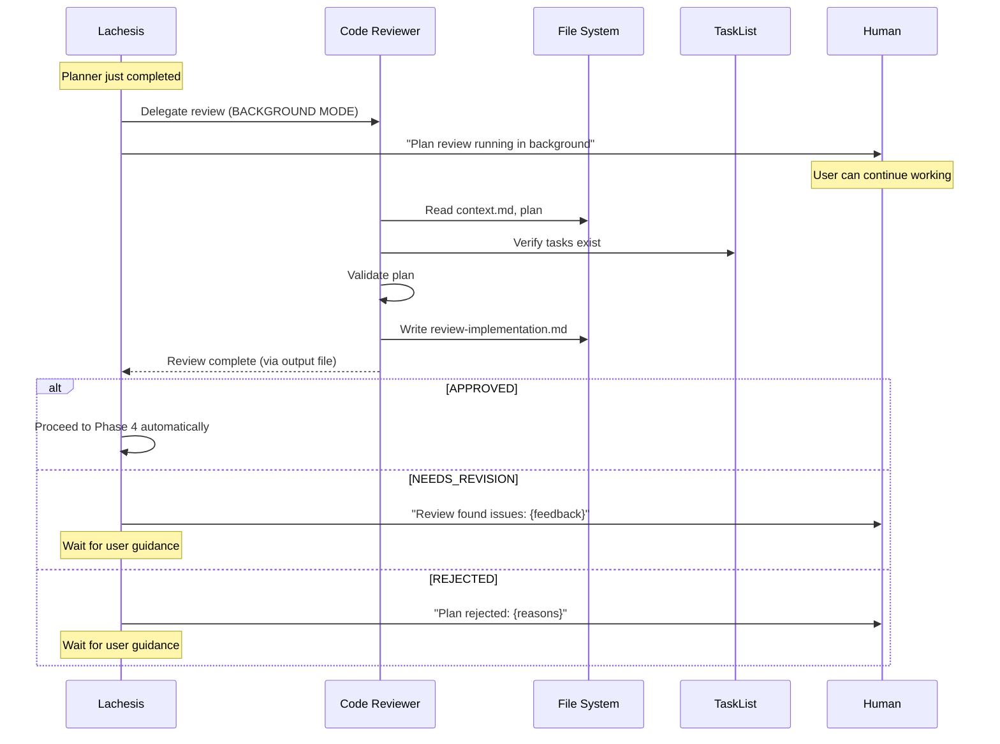
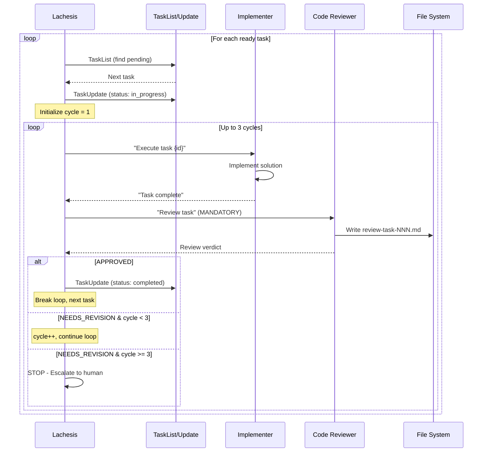
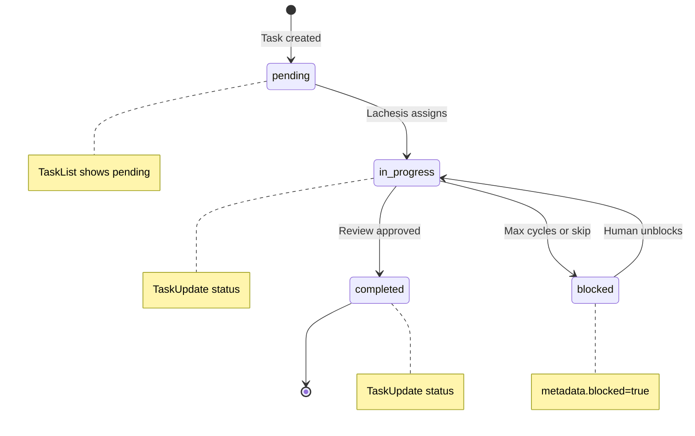
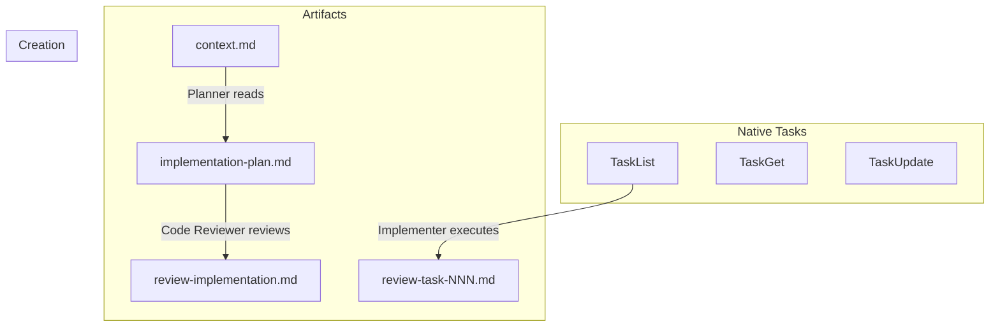

# Loom Plugin Workflow

This document explains how the Loom plugin coordinates multi-agent development workflows.

## Overview

Loom follows a **Context → Plan → Review → Execute** flow, with **Lachesis** (the coordinator agent) directing specialist agents through each phase.



## Mode Selection

At session start, Lachesis presents two workflow modes:

### Research Mode
For exploring ideas and designing before coding:
1. **Reconnaissance** - Explorer gathers codebase context
2. **Understanding** - Sequential questions about purpose, constraints, success
3. **Exploration** - 2-3 approaches with trade-offs
4. **Design Validation** - Incremental section-by-section validation
5. **Documentation** - Write context.md and research.md
6. **Handoff** - Transition to Ticket mode for implementation

### Ticket Mode
For executing on defined work:
1. **Context Definition** - What, Why, Acceptance Criteria
2. **Planning** - Implementation plan and native task creation
3. **Review** - Plan approval
4. **Execution** - Task implementation with review cycles
5. **Completion** - Final review and summary

## The Agents

| Agent | Model | Role | Color |
|-------|-------|------|-------|
| **Lachesis** | Opus | Coordinates workflow, never implements | Purple |
| **Planner** | Sonnet | Creates plans and native tasks | Blue |
| **Code Reviewer** | Sonnet | Reviews plans and implementations | Orange |
| **Implementer** | Sonnet | Executes individual tasks | Green |
| **Explorer** | Haiku | Fast codebase reconnaissance | Cyan |

## Skills-First Architecture

Loom uses **skills instead of MCP tools**. Before writing any artifact, agents must invoke the corresponding template skill:

| Artifact | Required Skill |
|----------|---------------|
| `context.md` | `context-template` |
| `implementation-plan.md` | `plan-template` |
| `review-*.md` | `review-template` |
| `research.md` | `research-template` |

## Native Task Management

Loom uses Claude Code's **native task system** instead of a tasks.md file:

| Tool | Purpose |
|------|---------|
| `TaskCreate` | Create new tasks with metadata |
| `TaskList` | List all tasks with status |
| `TaskGet` | Get full task details |
| `TaskUpdate` | Update status and metadata |

### Task Metadata Schema

```json
{
  "loom_task_id": "TASK-001",
  "ticket_id": "II-5092",
  "delivers_ac": ["AC1", "AC2"],
  "agent": "implementer",
  "files": ["src/feature.ts"],
  "group": "Phase 1: Setup",
  "cycle_count": 0,
  "max_cycles": 3
}
```

## Automatic Progression & Background Reviews

The Loom workflow uses **automatic progression** on the happy path to minimize user interruptions:

| After... | Lachesis does... | Mode |
|----------|------------------|------|
| Planner completes | Immediately delegates to code-reviewer | **Background** |
| Review: APPROVED | Immediately proceeds to next phase | Automatic |
| Implementer completes | Immediately delegates to code-reviewer | Foreground |
| Task review: APPROVED | Marks complete, proceeds to next task | Automatic |

### Background Review Behavior

When the planner completes creating `implementation-plan.md` and native tasks:

1. **No confirmation needed** - Lachesis immediately delegates to code-reviewer
2. **Background mode** - Uses `run_in_background: true` so user can continue working
3. **User notified** - "Plan review running in background. You can continue working."
4. **Output file** - When complete, Lachesis reads the output file to get the verdict

### User Intervention Points

Lachesis **stops and waits for user guidance** when:
- **NEEDS_REVISION** verdict - User decides how to address feedback
- **REJECTED** verdict - Fundamental issues need resolution
- **3-cycle limit reached** - Human escalation required

## Detailed Workflow

### Phase 1: Context Definition

The human and Lachesis collaborate to define **What**, **Why**, and **Acceptance Criteria**.



### Phase 2: Planning

The **Planner** transforms context into actionable work.



**Planner outputs:**

1. **implementation-plan.md**
   - Technical approach
   - Architecture decisions
   - AC → Task mapping
   - Risks & mitigations

2. **Native Tasks** (via TaskCreate)
   - Atomic tasks (1-15 min each)
   - Agent assignments in metadata
   - Dependencies via TaskUpdate
   - Per-task acceptance criteria

### Phase 3: Review Loop (Automatic & Background)

The **Code Reviewer** validates the plan against context.md.



### Phase 4: Task Execution (Mandatory Review Cycle)

**Lachesis** coordinates task execution with **mandatory Code Reviewer review** after each task.



### Task Lifecycle



### Phase 5: Completion

Final review validates all acceptance criteria are met.

## Artifact Flow

All artifacts are stored in `.claude/loom/threads/{ticket-id}/`:



## Human Commands

| Command | Purpose |
|---------|---------|
| `/loom-status` | Display current state, task progress |
| `/loom-approve` | Approve task, mark complete, move to next |
| `/loom-reject "feedback"` | Reject with feedback, increment cycle |
| `/loom-skip "reason"` | Skip blocked task, move to next |

## Skill Reference

| Skill | Used By | Purpose |
|-------|---------|---------|
| `loom-workflow` | Lachesis, Planner, Code Reviewer | Master workflow and delegation patterns |
| `context-template` | Lachesis | Template for context.md |
| `plan-template` | Planner | Template for implementation-plan.md |
| `review-template` | Code Reviewer | Template for review files |
| `research-template` | Lachesis | Template for research.md |

## Tool Reference

All agents use native Claude Code tools:

| Tool | Used By | Purpose |
|------|---------|---------|
| `Read` | All | Read files |
| `Write` | Lachesis, Planner, Code Reviewer, Implementer | Create files |
| `Edit` | Lachesis, Implementer | Update existing files |
| `Glob` | All | Find files |
| `Grep` | All | Search file contents |
| `Bash` | Implementer | Run commands |
| `Task` | Lachesis, Planner* | Delegate to agents |
| `Skill` | Lachesis, Planner, Code Reviewer | Load template skills |
| `TaskCreate` | Planner | Create native tasks |
| `TaskList` | All | List tasks |
| `TaskGet` | All | Get task details |
| `TaskUpdate` | Lachesis | Update task status |

*Planner may only delegate to Explorer for codebase research
